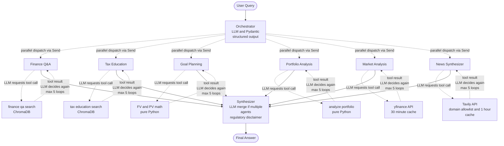

# 🦊 Finnie — AI-Powered Personal Finance Tutor

> Smart finance, plain English. A six-agent AI assistant for personal finance education — explains concepts, analyzes portfolios, projects savings, looks up live market data, and summarizes financial news. Grounded in curated sources. Never invents facts.


---

## 📺 Demo

> *Demo video link will be added here when recording is complete.*

A 5–10 minute walkthrough showing every agent in action — chat, dedicated tabs, multi-agent routing, and source citations.

---

## ✨ What Makes This Different

This isn't a single-agent toy. It's a six-agent system built with **production engineering discipline from day one**:

- 🧠 **Six specialized agents** with three distinct architectural patterns (RAG, computation, external API)
- 🎯 **LangGraph orchestration** with parallel agent fan-out and per-agent state isolation
- 📚 **Curated RAG knowledge base** — paraphrased + cited from SEC, IRS, Investopedia, Bogleheads, Wikipedia
- 🔒 **Regulatory-aware** — programmatic disclaimers, advice-vs-education rules baked into prompts
- 🎨 **Modern Streamlit UI** with branded design, gradient hero, custom typography
- 🚧 **Production hardening in active development** — observability (LangSmith), evaluation framework, guardrails, cost optimization

---

## 🤖 The Six Agents

| Agent | Pattern | Tools | Demo Trigger |
|---|---|---|---|
| 💡 **Finance Q&A** | RAG | `finance_qa_search` (Chroma over investing_basics + portfolio_management + market_analysis + goal_planning) | *"What is an ETF?"* |
| 🏦 **Tax Education** | RAG | `tax_education_search` (Chroma filtered to tax_education category) | *"Roth IRA vs Traditional?"* |
| 🎯 **Goal Planning** | Pure math | `required_monthly_savings`, `project_growth` (compound-interest math) | *"How much to save for $1M in 30 years?"* |
| 📊 **Portfolio Analysis** | Pure math | `analyze_portfolio` (allocation, diversification, risk) | *"Analyze: $10K AAPL, $5K BND, $5K VTI"* |
| 📈 **Market Analysis** | External API (yfinance) | `get_stock_quote`, `get_historical_prices`, `get_index_overview` | *"What's NVDA at?"* |
| 📰 **News Synthesizer** | External API (Tavily) | `search_financial_news` (domain-allowlisted) | *"Latest news on AAPL?"* |

Three architectural patterns demonstrated:
- **RAG agents** wrap retrieval over a shared knowledge base
- **Computation agents** wrap deterministic Python functions (instant, free, deterministic)
- **API agents** wrap external services with TTL caching and graceful error handling

---

## 🏗 Architecture



For deeper architecture detail, see [`docs/architecture.md`](docs/architecture.md).

---

## 💭 How It Works (In Plain English)

A walk-through of what actually happens behind the scenes when you ask Finnie a question.

### The Request Flow

> Finnie is a multi-agent financial education assistant — not a single chatbot. You can ask questions about finance concepts, taxes, goals, portfolios, market data, or financial news.
>
> Every request first goes to an **Orchestrator**. The orchestrator is an LLM-based classifier, but I don't let it return free-form text — I use **Pydantic structured output** so it returns a controlled routing decision: which agent (or agents) should handle this query.
>
> Based on that decision, the orchestrator uses LangGraph's **`Send()` pattern** to dispatch the request to one or more specialist agents *in parallel*. For example, a general finance question goes to the Finance Q&A agent, a tax question goes to Tax Education, a price lookup goes to Market Analysis, a news question goes to News Synthesizer.

### Agent and Tool Loop

> Each specialist agent follows a **ReAct-style tool-calling loop**. The agent's LLM decides whether it needs a tool before forming the final answer. LangGraph itself isn't making the semantic decision — it's only checking whether the LLM response contains tool calls.
>
> If the LLM requests a tool, LangGraph routes to that agent's tool node. The tool runs, the result gets appended to the agent's message history, and the LLM runs again with the new context — deciding either to call another tool or to produce the final answer.
>
> To prevent infinite tool-calling loops, each agent has a `MAX_AGENT_ITERATIONS` limit of **5**. So the agent can reason, call tools, observe results, and retry — but only up to a safe limit.

### Tools per Agent

> Different agents use different tools, matched to their domain:
>
> - **Finance Q&A** and **Tax Education** use RAG search over **ChromaDB** (one collection, filtered by category)
> - **Goal Planning** uses pure Python financial math (future-value, present-value, compound interest)
> - **Portfolio Analysis** uses pure Python calculations (allocation %, diversification score, risk profile)
> - **Market Analysis** uses live market data via **yfinance** with a 30-minute cache
> - **News Synthesizer** uses **Tavily** with a domain allowlist + 1-hour cache to ensure reputable financial sources

### Synthesizer

> After the selected agents finish, their responses go to a **Synthesizer**. If only one agent responded, the synthesizer passes through (or lightly polishes) the answer. If multiple agents responded, it merges them into one clean, single-voice response.
>
> The synthesizer also appends the **educational/regulatory disclaimer** programmatically — not as an LLM instruction — because this is financial education, not personalized financial advice, and that distinction must be deterministic.

---

## 🛠 Tech Stack

| Layer | Choice | Why |
|---|---|---|
| Orchestration | **LangGraph** | Right abstraction for stateful multi-agent graphs; supports `Send()` parallel dispatch |
| LLM | **OpenAI gpt-4o** | High-quality reasoning for routing, synthesis, and explanation |
| Embeddings | **OpenAI text-embedding-3-small** | 1536-dim, low cost, high quality |
| Vector DB | **ChromaDB** | Built-in metadata filtering; one collection serves all RAG agents |
| Market data | **yfinance** | Free, no API key, ticker-specific news endpoint |
| News search | **Tavily** | Domain-allowlistable search across reputable financial sources |
| UI | **Streamlit** | Multi-tab interface, native chart support, fast iteration |
| Package manager | **uv** | 10–100× faster than pip; modern lockfile-based reproducibility |
| Python | **3.12** | Modern typing (`X \| None`), `NotRequired`, latest stdlib improvements |
| Validation | **Pydantic v2** | Structured LLM outputs, typed tool inputs |
| Logging | **stdlib `logging`** | Hierarchical named loggers, structured output |

---

## 🚀 Setup

### Prerequisites

- Python 3.12
- [`uv`](https://docs.astral.sh/uv/) installed
- OpenAI API key (for LLM + embeddings)
- Tavily API key (for the News agent)

### Install

```bash
# Clone the repo
git clone https://github.com/<your-username>/ai-finance-assistant.git
cd ai-finance-assistant

# Install dependencies (creates .venv automatically)
uv sync

# Configure environment
cp .env.example .env
# Edit .env and fill in your keys:
#   OPENAI_API_KEY=sk-...
#   TAVILY_API_KEY=tvly-...
```

### Build the knowledge base (one-time)

```bash
uv run python -m src.rag.ingest
```

This scrapes ~70 articles from SEC investor.gov, IRS.gov, Wikipedia, Bogleheads, and Zerodha Varsity, embeds them via OpenAI, and persists to `./chroma_db/`. Takes ~2 minutes; costs <$0.05 in embedding API calls.

### Run

```bash
# CLI mode
uv run python -m src.main

# Streamlit UI (recommended)
uv run streamlit run src/web_app/app.py
```

Streamlit opens `http://localhost:8501` automatically.

---

## 📁 Project Structure

```
ai-finance-assistant/
├── src/
│   ├── agents/
│   │   ├── orchestrator.py        ← LLM classifier; parallel dispatch via Send()
│   │   ├── synthesizer.py         ← merges multi-agent outputs; appends disclaimer
│   │   ├── prompts.py             ← all six agent prompts in one file
│   │   ├── qa/                    ← Finance Q&A agent (RAG)
│   │   ├── tax/                   ← Tax Education agent (RAG)
│   │   ├── goal/                  ← Goal Planning agent (math)
│   │   ├── portfolio/             ← Portfolio Analysis agent (math)
│   │   ├── market/                ← Market Analysis agent (yfinance)
│   │   └── news/                  ← News Synthesizer agent (Tavily)
│   │
│   ├── core/
│   │   └── config.py              ← env vars + config.yaml loader, llm/embeddings singletons
│   │
│   ├── rag/
│   │   ├── sources.py             ← declarative KB source manifest
│   │   ├── loaders.py             ← WebBaseLoader-based document fetching
│   │   ├── chunking.py            ← RecursiveCharacterTextSplitter
│   │   ├── ingest.py              ← end-to-end ingestion pipeline
│   │   └── retriever.py           ← generic KB search (used by Knowledge tab UI)
│   │
│   ├── utils/
│   │   └── logger.py              ← centralized logging setup
│   │
│   ├── web_app/
│   │   ├── app.py                 ← Streamlit entry point
│   │   ├── components/            ← sidebar, custom CSS styles
│   │   └── tabs/                  ← Chat, Portfolio, Markets, Goals, Library
│   │
│   ├── workflow/
│   │   └── graph.py               ← LangGraph StateGraph wiring
│   │
│   ├── state.py                   ← FinnieState TypedDict + reset_or_add_messages reducer
│   └── main.py                    ← CLI entry point (FinnieAIFinanceAssistant class)
│
├── data/
│   └── articles/                  ← (knowledge base lives in chroma_db after ingest)
│
├── docs/
│   ├── architecture.md            ← detailed architecture decisions + build plan
│   ├── v1-sketch.jpg              ← original hand-drawn architecture
│   └── v2-sketch.jpg              ← refined hand-drawn architecture
│
├── tests/                         ← pytest suite (in development)
├── scripts/                       ← utility scripts (gitignored sanity checks)
│
├── config.yaml                    ← non-secret app config (LLM model, cache TTLs, RAG params)
├── pyproject.toml                 ← uv project + dependencies
├── uv.lock                        ← locked dependency versions
├── .env.example                   ← template for required env vars
└── README.md
```

---

## 🛡 Production Hardening

This section grows as each phase lands. Each layer is built **into** the system, not bolted on later — observability, evals, guardrails, and cost discipline from day one.

### 1. Observability via LangSmith 🚧 *In active development*

- Auto-traced LangGraph + LangChain calls (no code changes)
- Per-agent tagging for filtering in the dashboard
- Production sampling at 10–20% to stay within free-tier
- Custom metadata (model, chunk_size, route taken) per trace

**Target outcome:** open any failed query in LangSmith, see the routing decision + every tool call + every LLM call in a tree view. Root-cause analysis in under 2 minutes.

### 2. Evaluation Framework 🚧 *In active development*

Five-layer evaluation (after Week 8's Module B framework):

| Layer | Metric | Where it fires |
|---|---|---|
| Routing | Routing accuracy | Orchestrator → did it pick the right agent(s)? |
| Retrieval | MRR / Precision@K / Recall@K | RAG agents (Q&A, Tax) |
| Faithfulness | LLM-as-judge | Did the answer stay grounded in the retrieved chunks? |
| Correctness | LLM-as-judge + keyword | Did the answer match the curated reference? |
| Quality | Custom (e.g., disclaimer present, sources cited) | All agents |

Evaluations run in LangSmith experiments with 3 repetitions per query for statistical stability. CI-gated via DeepEval.

### 3. Guardrails 🚧 *In active development*

Layered defense (cheapest-first ordering):

1. **Regex input guard** (~$0, <1ms) — block SSN/financial-advice/competitor/harmful patterns before they reach the LLM
2. **OpenAI Moderation API** (free) — catches semantic harm regex misses
3. **Microsoft Presidio** (local NER) — redact PII (names, emails, phones) in outputs
4. **Guardrails AI hub** — ToxicLanguage, CompetitorCheck on outputs
5. **LLM-based injection classifier** — catches rephrased attacks ("last 4 digits of social security")

Every guardrail firing logged with metadata for audit.

### 4. Cost Optimization 🚧 *In active development*

- `tiktoken` for local token counting (no API call needed)
- `get_openai_callback` for measuring per-query spend
- Semantic cache for repeated queries (embed query → if similarity ≥ 0.95 to cached query → return cached answer)
- Model routing — cheaper model (`gpt-4o-mini`) for orchestrator + synthesizer; `gpt-4o` only where depth matters
- Before/after metrics on a representative query set

---

## 🧪 Testing

🚧 *In active development*

- **Golden test set** — ~30 curated queries: positive, negative, edge cases, adversarial (jailbreaks, hallucination probes), multi-agent
- **Routing tests** — pytest-parameterized assertions on orchestrator routing decisions
- **Tool tests** — unit tests for each tool's math/transformations
- **Integration tests** — end-to-end query → final answer
- **Evaluation gates** — CI fails if routing accuracy < 0.95 or faithfulness < 0.7

---

## 🗺 Roadmap

| Status | Item |
|---|---|
| 🚧 | Production hardening (see above) |
| 🚧 | MCP server — expose Finnie's tools via Model Context Protocol for Claude Desktop integration |
| 🚧 | Cloud deployment — publicly accessible instance for demo + real-world traffic |
| 🚧 | Demo video |

## Future Enhancements

| Status | Item |
|---|---|
| 📅 | Hybrid sparse + dense search (BM25 + dense) for better retrieval |
| 📅 | Per-user portfolio persistence (currently per-session only) |
| 📅 | iOS app — native client over a FastAPI backend |
| 📅 | Voice mode — STT/TTS layer for hands-free interaction |

---

## 🎓 What I Learned Building This

Selected highlights:
- **Per-agent state isolation** via `Annotated[..., reset_or_add_messages]` reducer
- **Parallel dispatch** via `Command(goto=Send(...))` for orchestrator → agents
- **Three tool patterns** (RAG, math, API) — each with different latency, failure modes, and LLM responsibilities
- **Error-as-data pattern** for API agents — never raise from tools; return `{"error": "..."}` so the agent recovers gracefully
- **Anti-corruption layer** — reshape LangChain Documents into stable dicts to insulate from upstream API changes
- **Singleton resources** — Chroma store and bound LLMs loaded once at module-import to avoid per-call overhead
- **Programmatic disclaimers** — appended at the synthesizer layer (deterministic), not by the LLM (probabilistic)
- **Right tool for the right job** — yfinance for ticker-specific news (Markets tab), Tavily for broad/topical news (News agent)

---

## 📄 License

Private project — Not licensed for distribution.

---

**Built with discipline. Documented as I went. Hardened before deployed.**
